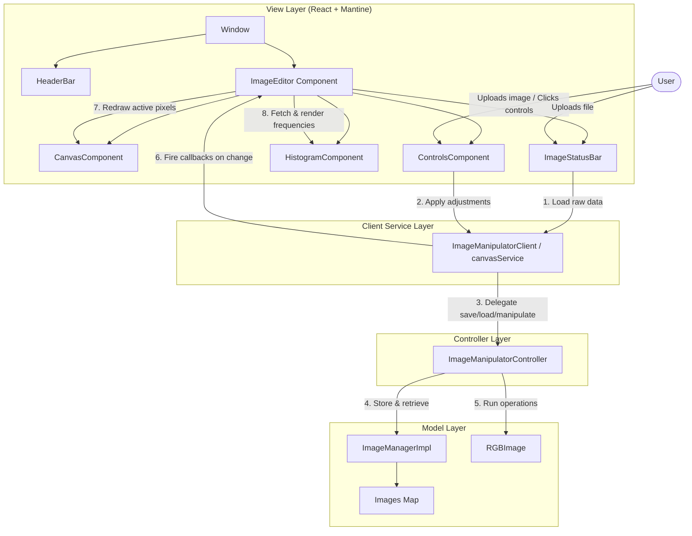

# PhotoFix 📸

PhotoFix is a modern, high-performance web-based image manipulation program built with **React**, **TypeScript**, **Vite**, and **Mantine UI**. It implements a strict Model-View-Controller (MVC) architecture to process, filter, and render images directly in the browser.

---

## 🚀 Key Features

PhotoFix supports a wide range of real-time image processing operations:

*   **Sliders & Adjustments:**
    *   **Brightness:** Fine-tune brightness offset from -100% to +100%.
    *   **Contrast:** Adjust contrast range dynamically.
    *   **Saturation:** Convert pixels to HSL, scale saturation, and convert back to RGB.
*   **Geometric Flips:**
    *   **Vertical Flip:** Flip the image upside down.
    *   **Horizontal Flip:** Flip the image mirroring it horizontally.
*   **Color Transformations:**
    *   **Sepia:** Apply a nostalgic sepia tone filter.
    *   **Invert:** Invert all RGB channel values (255 - value).
*   **Greyscale Converters:**
    *   **Value:** Set all channels to the maximum of R, G, B.
    *   **Luma:** Use weighted luminosity formula (0.2126R + 0.7152G + 0.0722B).
    *   **Balance (Intensity):** Set channels to the mathematical average (R + G + B) / 3.
*   **Creative & Convoluted Filters:**
    *   **Blur:** Apply a 5x5 box blur kernel to smooth pixels.
    *   **Sharpen:** Apply a 3x3 high-pass filter kernel to enhance edges.
    *   **Pixelate:** Group pixels into 10x10 blocks and average their colors.
    *   **Dither:** Perform Floyd-Steinberg error-diffusion dithering on a greyscale luma representation.
*   **Real-time Analytics:**
    *   **Live Histogram Chart:** Visualize color frequency distributions for Red, Green, and Blue channels using Chart.js.

---

## 🏗️ MVC Architecture

PhotoFix follows a clean separation of concerns using the Model-View-Controller pattern, allowing developers to easily extend image processing algorithms without altering the UI logic.



### 1. Model Layer
*   `ImageInterface.ts`: Defines the contract for all operations a model representation must support (e.g., `adjustBrightness`, `sepia`, `blur`, etc.).
*   `RGBImage.ts`: Implements `ImageInterface` by storing pixel data in a 3D number array (`_pixels[y][x][channel]`) and executing the raw array math for filters, convolutions, and flips.
*   `ImageChannel.ts`: Enums `RED = 0`, `GREEN = 1`, and `BLUE = 2`.
*   `ImageManager.ts` & `ImageManagerImpl.ts`: Manages instances of named images (caching original vs working copies) and calculates 256-element arrays for RGB channel histogram statistics.

### 2. Controller Layer
*   `ImageManipulatorController.ts`: The central orchestration class. It interacts directly with the `ImageManager` models, maps canvas-level raw pixel arrays (`ImageData`) into `RGBImage` entities, and runs requested operations.

### 3. Service / Client Layer
*   `canvasService.ts`: A singleton client (`ImageManipulatorClient`) serving as the facade for React components. It keeps track of the active original and operational image identifiers, batches and debounces adjustment triggers, and notifies subscribers of image changes.

### 4. View Layer
*   `ImageEditor.tsx`: Main parent state component.
*   `ControlsComponent.tsx`: Renders sliders and action buttons, debouncing sliders locally to guarantee smooth UI responsiveness.
*   `CanvasComponent.tsx`: Houses the HTML5 canvas element displaying the current operational pixels.
*   `HistogramComponent.tsx`: Displays the live line graph representing pixel density frequencies.
*   `ImageStatusBar.tsx`: Manages image loading from the filesystem and downloading the modified canvas state as an image file.

---

## 🛠️ Requirements

Ensure you have the following installed:
*   [Node.js](https://nodejs.org/) (version 18+ recommended)
*   `npm` (or `yarn`/`pnpm`)

### Dependencies List
Key project dependencies managed in `package.json`:
*   `react` & `react-dom` (v19)
*   `vite` (v6)
*   `typescript`
*   `@mantine/core` & `@mantine/hooks` (v7.17)
*   `chart.js` & `react-chartjs-2`
*   `lodash` (for debounce)
*   `jest` & `ts-jest` (for testing)

---

## 🚀 Getting Started & Setup

Follow these steps to run the application locally:

### 1. Install Dependencies
Run the install command in the project root:
```bash
npm install
```

### 2. Launch Development Server
Start the local Vite development server:
```bash
npm run dev
```
Open your browser and navigate to `http://localhost:5173` (or the port specified in your terminal output) to view the editor.

### 3. Build for Production
To bundle and compile the application for deployment:
```bash
npm run build
```
This runs TypeScript checking (`tsc`) and compiles all resources into optimized static files in the `/dist` folder, manual chunking vendor bundles (React, Mantine, and Chart.js) for quick loading times.

### 4. Preview Build Locally
To run a local server serving the built `/dist` directory:
```bash
npm run preview
```

---

## 🧪 Running Unit Tests

The model layer has automated test suites checking image creation, matrix calculations, bounding constraints, and exception handling.

To execute the Jest test suite:
```bash
npm test
```
